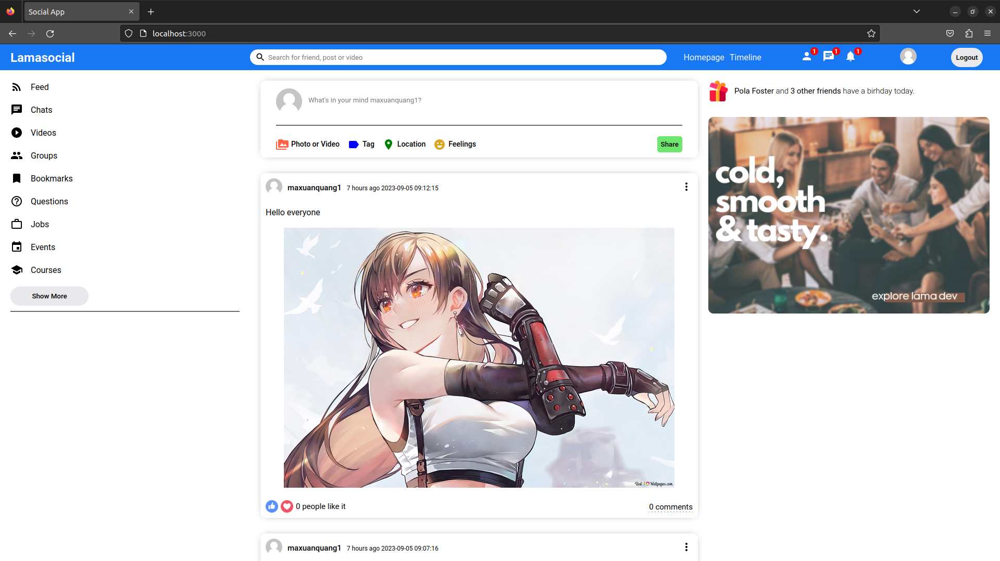

<h1 align="center">XSocial</h1>



## Table of contents

- [Description](#description)
- [Installation](#installation)
  - [Requirements](#requirements)
  - [Cloning the Project](#cloning-the-project)
  - [Setting Up Environment Variables](#setting-up-environment-variables)
  - [Building the Frontend](#building-the-frontend)
  - [Setting Up Caddy Reverse Proxy](#setting-up-caddy-reverse-proxy)
  - [Running Docker Compose](#running-docker-compose)
  - [Database Migration](#database-migration)

## Description

XSocial is a simple social networking service with basic functionalities such as posting, liking, commenting, and viewing newsfeeds. It is designed to be easily hosted on a local machine or in the cloud.

## Installation

### Requirements

Make sure you have Docker or a Docker-compatible container runtime installed locally to run XSocial.

### Cloning the Project

Clone the XSocial repository to your local machine:

```bash
git clone https://github.com/maxuanquang/xsocial.git
```

### Setting Up Environment Variables

XSocial use AWS S3 to store media files. Before running XSocial, you need to set up your environment variables by creating a `.env` file in the project root. Fill in the following details:

```bash
AWS_S3_BUCKET="example-bucket-name"
AWS_REGION="example-region-name"
AWS_ACCESS_KEY_ID="example-access-key-id"
AWS_SECRET_ACCESS_KEY="example-access-key-secret"

REACT_APP_API_SERVER="https://localhost"
GENERATE_SOURCEMAP=false
```

### Building the Frontend

Build the frontend of XSocial by running the following command:

```bash
make build_web
```

### Setting Up Caddy Reverse Proxy

Install [Caddy](https://caddyserver.com/docs/install#debian-ubuntu-raspbian) on your machine, then setup the Caddy server by running:

```bash
sudo make caddy
```

### Running Docker Compose

To start all XSocial services, run the following command:

```bash
make compose_up
```

### Database Migration

Before running the services, make sure to migrate the database:

```bash
make up_migration
```

Once the services are running and database is migrated, you can access XSocial by navigating to `https://localhost` in your web browser.
